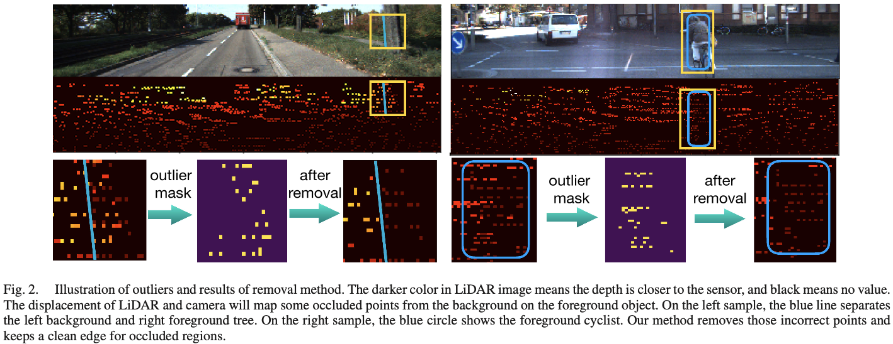

# Occlusion Removal
When projection from **LiDAR cloud points** to **depth map**. There is **occlusion regions** due to the relative translation and rotation between LiDAR and camera.

Here is an **Occlusion Removal algorithm** implementation, referring *Zhao, Yiming, et al. "A surface geometry model for lidar depth completion." IEEE Robotics and Automation Letters 6.3 (2021): 4457-4464.*

